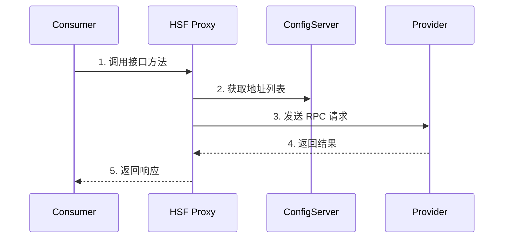

# Draw.io 使用示例

本文档展示如何在技术笔记中使用 draw.io 功能。

---

## 示例 1：创建 HSF 架构图

### 场景

你正在撰写 HSF 深度调研笔记，需要一张展示 HSF 在阿里技术栈中位置的架构图。

### 步骤

#### 1. 判断使用 draw.io

这是一个核心架构图，需要：
- ✅ 后续维护和更新
- ✅ 长期存在于文档中
- ✅ 可能有团队协作编辑需求

**结论**：使用 draw.io（而非 drafter）

#### 2. 创建 .drawio 文件

路径：`resources/images/hsf-deep-dive/hsf-architecture.drawio`

内容：
```xml
<?xml version="1.0" encoding="UTF-8"?>
<mxfile host="app.diagrams.net" modified="2024-01-15T10:00:00.000Z">
  <diagram id="hsf-arch-001" name="HSF Architecture">
    <mxGraphModel dx="1422" dy="762" grid="1" gridSize="10" pageWidth="1200" pageHeight="800">
      <root>
        <mxCell id="0" />
        <mxCell id="1" parent="0" />
        
        <!-- Consumer 层 -->
        <mxCell id="10" value="Consumer&#10;（服务调用方）" style="rounded=1;whiteSpace=wrap;html=1;fillColor=#5D7C99;strokeColor=#4A6580;fontColor=#FFFFFF;fontSize=14;" vertex="1" parent="1">
          <mxGeometry x="100" y="100" width="180" height="80" as="geometry" />
        </mxCell>
        
        <!-- Provider 层 -->
        <mxCell id="11" value="Provider&#10;（服务提供方）" style="rounded=1;whiteSpace=wrap;html=1;fillColor=#5D7C99;strokeColor=#4A6580;fontColor=#FFFFFF;fontSize=14;" vertex="1" parent="1">
          <mxGeometry x="920" y="100" width="180" height="80" as="geometry" />
        </mxCell>
        
        <!-- ConfigServer -->
        <mxCell id="12" value="ConfigServer&#10;（注册中心）" style="rounded=1;whiteSpace=wrap;html=1;fillColor=#DCE6F1;strokeColor=#64748B;fontSize=14;" vertex="1" parent="1">
          <mxGeometry x="510" y="350" width="180" height="80" as="geometry" />
        </mxCell>
        
        <!-- 其他中间件 -->
        <mxCell id="13" value="Diamond&#10;配置中心" style="rounded=1;whiteSpace=wrap;html=1;fillColor=#DCE6F1;strokeColor=#64748B;fontSize=12;" vertex="1" parent="1">
          <mxGeometry x="200" y="550" width="120" height="60" as="geometry" />
        </mxCell>
        
        <mxCell id="14" value="TDDL&#10;数据库" style="rounded=1;whiteSpace=wrap;html=1;fillColor=#DCE6F1;strokeColor=#64748B;fontSize=12;" vertex="1" parent="1">
          <mxGeometry x="400" y="550" width="120" height="60" as="geometry" />
        </mxCell>
        
        <mxCell id="15" value="MetaQ&#10;消息队列" style="rounded=1;whiteSpace=wrap;html=1;fillColor=#DCE6F1;strokeColor=#64748B;fontSize=12;" vertex="1" parent="1">
          <mxGeometry x="600" y="550" width="120" height="60" as="geometry" />
        </mxCell>
        
        <mxCell id="16" value="EagleEye&#10;链路追踪" style="rounded=1;whiteSpace=wrap;html=1;fillColor=#DCE6F1;strokeColor=#64748B;fontSize=12;" vertex="1" parent="1">
          <mxGeometry x="800" y="550" width="120" height="60" as="geometry" />
        </mxCell>
        
        <!-- 连接线 -->
        <mxCell id="20" value="RPC 调用" style="endArrow=classic;html=1;strokeColor=#64748B;strokeWidth=2;rounded=1;" edge="1" source="10" target="11" parent="1">
          <mxGeometry x="-0.3" y="0" relative="1" as="geometry">
            <mxPoint as="offset" />
          </mxGeometry>
        </mxCell>
        
        <mxCell id="21" value="服务注册" style="endArrow=classic;html=1;strokeColor=#64748B;strokeWidth=2;dashed=1;rounded=1;" edge="1" source="11" target="12" parent="1">
          <mxGeometry relative="1" as="geometry" />
        </mxCell>
        
        <mxCell id="22" value="地址推送" style="endArrow=classic;html=1;strokeColor=#64748B;strokeWidth=2;dashed=1;rounded=1;" edge="1" source="12" target="10" parent="1">
          <mxGeometry relative="1" as="geometry" />
        </mxCell>
        
        <!-- 底层依赖 -->
        <mxCell id="23" style="endArrow=none;html=1;strokeColor=#64748B;strokeWidth=1;dashed=1;" edge="1" source="12" target="13" parent="1">
          <mxGeometry relative="1" as="geometry" />
        </mxCell>
        
        <mxCell id="24" style="endArrow=none;html=1;strokeColor=#64748B;strokeWidth=1;dashed=1;" edge="1" source="12" target="14" parent="1">
          <mxGeometry relative="1" as="geometry" />
        </mxCell>
        
        <mxCell id="25" style="endArrow=none;html=1;strokeColor=#64748B;strokeWidth=1;dashed=1;" edge="1" source="12" target="15" parent="1">
          <mxGeometry relative="1" as="geometry" />
        </mxCell>
        
        <mxCell id="26" style="endArrow=none;html=1;strokeColor=#64748B;strokeWidth=1;dashed=1;" edge="1" source="12" target="16" parent="1">
          <mxGeometry relative="1" as="geometry" />
        </mxCell>
      </root>
    </mxGraphModel>
  </diagram>
</mxfile>
```

#### 3. 导出 PNG

在 draw.io 中打开文件，导出为 PNG：
- 文件 → 导出为 → PNG
- 分辨率：300 DPI
- 保存到：`resources/images/hsf-deep-dive/hsf-architecture.png`

#### 4. 在文档中引用

在 `note/hsf-deep-dive.md` 中：

```markdown
### 1.3 在阿里技术栈中的位置


HSF 是阿里中间件体系中负责**服务间通信**的核心组件，与 TDDL（数据库）、
Diamond（配置中心）、MetaQ（消息队列）共同构成微服务基础设施。
```

---

## 示例 2：创建订单创建流程图

### 场景

你需要展示电商订单创建的完整流程，涉及多个中间件协作。

### .drawio 文件关键部分

```xml
<!-- 用户请求 -->
<mxCell id="10" value="用户请求" style="rounded=1;fillColor=#5D7C99;fontColor=#FFFFFF;" vertex="1" parent="1">
  <mxGeometry x="50" y="350" width="120" height="60" as="geometry" />
</mxCell>

<!-- HSF 服务 -->
<mxCell id="11" value="HSF OrderService&#10;createOrder()" style="rounded=1;fillColor=#DCE6F1;" vertex="1" parent="1">
  <mxGeometry x="300" y="350" width="160" height="60" as="geometry" />
</mxCell>

<!-- TDDL 数据库 -->
<mxCell id="12" value="TDDL&#10;order_db" style="shape=cylinder;fillColor=#E2E8F0;" vertex="1" parent="1">
  <mxGeometry x="600" y="200" width="120" height="100" as="geometry" />
</mxCell>

<!-- MetaQ 消息队列 -->
<mxCell id="13" value="MetaQ&#10;ORDER_TOPIC" style="rounded=1;fillColor=#E2E8F0;" vertex="1" parent="1">
  <mxGeometry x="600" y="500" width="120" height="100" as="geometry" />
</mxCell>

<!-- EagleEye 链路追踪 -->
<mxCell id="14" value="EagleEye&#10;TraceId: xxx" style="rounded=1;fillColor=#F59E0B;fontColor=#FFFFFF;" vertex="1" parent="1">
  <mxGeometry x="900" y="350" width="140" height="60" as="geometry" />
</mxCell>

<!-- 成功响应 -->
<mxCell id="15" value="返回订单ID" style="ellipse;fillColor=#22C55E;fontColor=#FFFFFF;" vertex="1" parent="1">
  <mxGeometry x="1200" y="350" width="120" height="60" as="geometry" />
</mxCell>

<!-- 带标签的连接线 -->
<mxCell id="20" value="1.发起请求" style="endArrow=classic;strokeColor=#64748B;strokeWidth=2;" edge="1" source="10" target="11" parent="1">
  <mxGeometry relative="1" as="geometry" />
</mxCell>

<mxCell id="21" value="2.写入订单" style="endArrow=classic;strokeColor=#64748B;strokeWidth=2;" edge="1" source="11" target="12" parent="1">
  <mxGeometry relative="1" as="geometry" />
</mxCell>

<mxCell id="22" value="3.发送消息" style="endArrow=classic;strokeColor=#64748B;strokeWidth=2;" edge="1" source="11" target="13" parent="1">
  <mxGeometry relative="1" as="geometry" />
</mxCell>

<mxCell id="23" value="4.记录链路" style="endArrow=classic;strokeColor=#64748B;strokeWidth=2;dashed=1;" edge="1" source="11" target="14" parent="1">
  <mxGeometry relative="1" as="geometry" />
</mxCell>

<mxCell id="24" value="5.返回结果" style="endArrow=classic;strokeColor=#64748B;strokeWidth=2;" edge="1" source="14" target="15" parent="1">
  <mxGeometry relative="1" as="geometry" />
</mxCell>
```

---

## 示例 3：何时选择不同方案

### 场景对比

| 场景 | 推荐方案 | 原因 |
|------|---------|------|
| HSF 核心架构图 | draw.io | 需要长期维护，可能频繁更新 |
| 订单创建流程图 | draw.io | 复杂流程（>10 个步骤），需要清晰展示 |
| HTTP vs RPC 对比图 | drafter | 简单对比，一次性使用 |
| 方法调用时序图 | Mermaid | 代码块内嵌，即时渲染 |
| 配置推送机制图 | draw.io | 需要展示交互细节，可能调整 |
| 学习路线图 | drafter | 静态展示，不需要编辑 |

### 实际代码示例

**使用 Mermaid（简单流程）**：

```markdown
### HSF 调用流程


```

**使用 draw.io（复杂架构）**：

```markdown
### HSF 架构总览


> 图片来源：hsf-architecture.drawio（可在 Obsidian 中编辑）
```

---

## 最佳实践总结

### 1. 文件管理

```
resources/images/文档名/
├── 图名.drawio    # 源文件（纳入 Git）
├── 图名.png       # 导出图片（文档引用）
└── 图名.svg       # 可选：矢量格式
```

### 2. 命名规范

- ✅ `hsf-architecture.drawio` - 清晰明确
- ✅ `order-creation-flow.drawio` - 描述性强
- ❌ `diagram1.drawio` - 含义不明
- ❌ `test.drawio` - 无意义

### 3. 版本管理

- `.drawio` 文件是 XML 文本，**必须纳入 Git**
- 每次修改后提交，可追踪图表变更历史
- PNG 图片也建议纳入 Git（便于直接查看）

### 4. 协作编辑

- 团队成员安装 Obsidian Draw.io 插件
- 直接在 Obsidian 中编辑 `.drawio` 文件
- 导出 PNG 后同步更新文档引用

### 5. 性能优化

- 大图导出 PNG 时选择合适分辨率（1920x1080 足够）
- 文档中只引用 PNG，不要嵌入 `.drawio`（影响加载速度）
- 定期清理未使用的 `.drawio` 文件

---

## 常见问题

### Q1: draw.io 和 drafter 该选哪个？

**A**: 看是否需要后续编辑：
- 需要编辑 → draw.io
- 一次性使用 → drafter

### Q2: 如何在 Obsidian 中编辑 .drawio 文件？

**A**: 
1. 安装 "Draw.io Integration" 插件
2. 点击 `.drawio` 文件即可编辑
3. 保存后自动更新

### Q3: 导出 PNG 后文件太大怎么办？

**A**: 
- 降低分辨率（150 DPI 通常足够）
- 使用 PNG 压缩工具（如 pngquant）
- 考虑导出为 WebP 格式

### Q4: 能否批量导出多个 .drawio 文件？

**A**: 可以，使用 drawio CLI：

```bash
# 安装 drawio CLI
npm install -g drawio-cli

# 批量导出
for f in *.drawio; do
  drawio -x -o "${f%.drawio}.png" "$f"
done
```

### Q5: 如何保证图表风格统一？

**A**: 
- 使用统一的色彩规范（主技能中已定义）
- 创建模板文件（`template.drawio`）
- 团队共享样式库

---

## 参考资源

- **draw.io 子技能**：`drawio-diagram/SKILL.md`
- **在线编辑器**：https://app.diagrams.net/
- **桌面应用**：https://github.com/jgraph/drawio-desktop/releases
- **Obsidian 插件**：Draw.io Integration
- **样式参考**：https://www.drawio.com/doc/faq/shape-style
- **mxGraph 文档**：https://jgraph.github.io/mxgraph/
