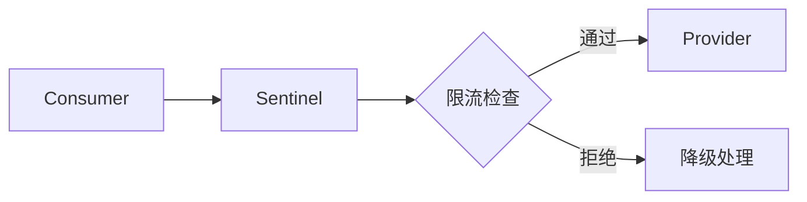

# Phase 1: 内容生成

## 工作流

```
Phase 1: deep-research 调研
  ↓
Phase 2: 内容整理
  ↓
Phase 3: 场景写作
  ↓
Phase 4: 智能配图
  ↓
🔍 Review 检查
  ↓
输出：初稿文档（含图像提示词）
```

---

## Phase 1: 深度调研

### 调用 deep-research skill

```markdown
Skill deep-research "调研 [技术主题]，包括：
- 技术定义和核心原理
- 主要功能和使用场景
- 配置方法和代码示例
- 最佳实践和常见问题
- 与相关技术的对比分析
- 在阿里技术栈中的位置"
```

### 输出要求

- 结构化素材（约 5000 字）
- 包含技术定义、原理、使用场景
- 提供可运行的代码示例
- 列出最佳实践和常见问题

---

## Phase 2: 内容整理

### 确定核心场景

选择一个贴切的业务场景贯穿全文：
- 电商下单（推荐）
- 用户登录
- 数据查询
- 消息发送

### 组织逻辑结构

按"遇到问题 → 引入技术 → 解决问题"组织：

```
1. 遇到问题（场景中的具体困境）
2. 没有它会怎样（朴素方案行不通）
3. 技术引入（一句话定义 + 类比）
4. 快速上手（最小可运行代码）
5. 深入原理（架构图 + 底层流程）
6. 实战应用（场景中的具体应用）
7. 最佳实践（生产经验总结）
```

### 识别插图位置

标记需要插图的关键位置：
- 技术架构图
- 调用流程图
- 场景示意图
- 对比表格

---

## Phase 3: 场景写作

### 五步讲解法

#### 1. 遇到问题

```markdown
描述场景中的具体困境：

"在电商大促期间，订单服务面临突发流量冲击..."
```

#### 2. 没有它会怎样

```markdown
朴素方案的问题：

"如果手动限流，需要人工监控、手动降级，响应太慢..."
```

#### 3. 一句话定义 + 类比

```markdown
技术定义和生活比喻：

"Sentinel 就像交通路口的红绿灯，控制车辆通行节奏..."
```

#### 4. 快速上手

```markdown
最小可运行代码示例：

<dependency>
    <groupId>com.alibaba.csp</groupId>
    <artifactId>sentinel-core</artifactId>
    <version>1.8.6</version>
</dependency>

// 定义资源
try (Entry entry = SphU.entry("OrderService")) {
    // 业务逻辑
} catch (BlockException e) {
    // 限流降级
}
```

#### 5. 深入原理

```markdown
架构图 + 底层流程：

> 📷 Sentinel 架构概览

1. SlotChain 责任链
2. ProcessorSlot 处理节点
3. 统计指标收集
```

### 章节总结

每个核心章节后添加：

```markdown
> 💡 **核心要点**
> 
> - 要点 1
> - 要点 2
> - 要点 3
```

### 文档导航

章节末尾添加导航：

```markdown
---

**下一步**：[[下一篇相关笔记]]
**上一篇**：[[上一篇相关笔记]]
**返回目录**：[[middleware-learning-path]]
```

---

## Phase 4: 智能配图

### 图像类型决策

```
需要插图？
  ↓
复杂架构图（>10 个组件）？
  ├─ 是 → 使用 draw.io ✅
  └─ 否 → 简单流程/时序图？
           ├─ 是 → 使用 Mermaid ✅
           └─ 否 → 需要概念插图？
                    ├─ 是 → 使用 AI 图像提示词 ✅
                    └─ 否 → 使用对比表格
```

### 方式 1：draw.io

**适用**：复杂架构图、多层架构、数据流向

**工作流**：
1. 创建 `.drawio` XML 文件
2. 遵循工程蓝图风格（见 `drawio-diagram/SKILL.md`）
3. 保存到 `resources/images/{文档名}/`
4. 导出 PNG 并在文档中引用

**示例**：
```markdown


> 📷 Sentinel 分层防护架构
```

### 方式 2：Mermaid

**适用**：简单流程图、时序图

**示例**：
```markdown

```

### 方式 3：AI 图像提示词

**适用**：概念插图、场景示意

**格式**：
```markdown
[🎨 生图提示词]
```
极简科技教育图解，扁平矢量插画，纯白底 #F8FAFC。
[图名]，[布局描述]。
[元素 1 描述]（圆角 12px，填充 #5D7C99，文字 #1E293B）
[元素 2 描述]（圆角 8px，填充 #DCE6F1）
连接线：贝塞尔曲线，#64748B，箭头指向数据流向
每个框体带柔和弥散阴影
字体：中文思源黑体，英文 Inter
风格：高端工程教材，苹果 Keynote 审美
```

> 📷 图片描述：[20字以内的描述信息]
```

**规则**：
- 必须结合上下文内容
- 描述具体的视觉元素
- 指定色彩、布局、风格
- 遵循工程蓝图风格规范

---

## 🔍 Review 检查

### 自动检查流程

```
Phase 4 完成
  ↓
Review 自动执行
  ├─ 1. 内容逻辑一致性检查
  ├─ 2. 技术准确性检查
  ├─ 3. 场景连贯性检查
  └─ 4. 代码示例完整性检查
  ↓
生成检查报告
  ├─ ✅ 全部通过 → 输出初稿
  └─ ❌ 有未通过 → 返回 Phase 3 重新写作
```

### 检查清单

#### 1. 内容逻辑一致性

- [ ] 章节间有因果递进关系
- [ ] 场景贯穿全文不断裂
- [ ] 技术引入自然不生硬
- [ ] 前后内容无矛盾

#### 2. 技术准确性

- [ ] 技术定义准确无误
- [ ] 代码示例语法正确
- [ ] 配置方法切实可行
- [ ] 原理描述符合实际

#### 3. 场景连贯性

- [ ] 核心场景贴切易懂
- [ ] 示例符合场景设定
- [ ] 类比恰当不牵强
- [ ] 场景转换自然

#### 4. 代码示例完整性

- [ ] 代码可直接运行
- [ ] 包含必要注释说明
- [ ] 有完整上下文
- [ ] 关键步骤不缺失

### 检查报告格式

```markdown
# Review 检查报告

## 1. 内容逻辑一致性
✅ 通过 - 章节间有明确的因果递进关系

## 2. 技术准确性
✅ 通过 - 技术定义准确，代码示例正确

## 3. 场景连贯性
✅ 通过 - 电商场景贯穿全文，类比恰当

## 4. 代码示例完整性
✅ 通过 - 所有代码示例可运行，包含完整注释

## 总结
✅ 全部通过，可以输出初稿
```

---

## 📝 输出格式

### 初稿文档结构

```markdown
---
title: "{技术名称} 深度剖析"
tags:
  - "{技术名}"
  - "中间件"
  - "阿里技术栈"
  - "深度调研"
created: {当前日期 YYYY-MM-DD}
updated: {当前日期 YYYY-MM-DD}
related:
  - "[[相关笔记 1]]"
  - "[[相关笔记 2]]"
---

# {技术名称} 深度剖析

## 1. 遇到什么问题

### 1.1 场景描述
...

## 2. 没有它会怎样

### 2.1 朴素方案
...

## 3. 技术定义

### 3.1 一句话定义
...

## 4. 快速上手

### 4.1 最小示例
...

## 5. 深入原理

### 5.1 架构设计
...

[🎨 生图提示词]
```
...
```

> 📷 图片描述

## 6. 实战应用

...

## 7. 最佳实践

...

---

**下一步**：[[下一篇相关笔记]]
**返回目录**：[[middleware-learning-path]]
```

---

## ✅ 完成标准

Phase 1 完成的标志：

- ✅ deep-research 调研完成
- ✅ 内容结构整理完成
- ✅ 场景写作完成
- ✅ 智能配图完成
- ✅ Review 检查全部通过
- ✅ 输出初稿文档

---

**最后更新**：2026-05-14  
**版本**：5.0.0
